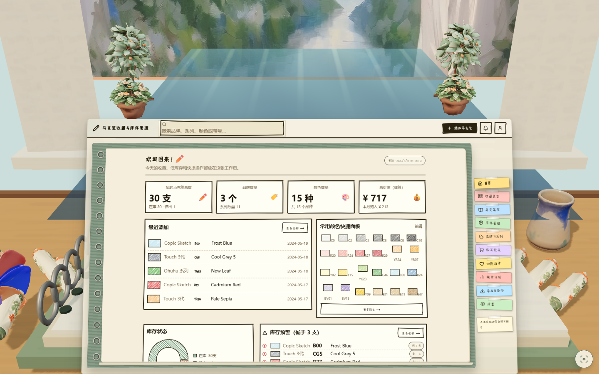
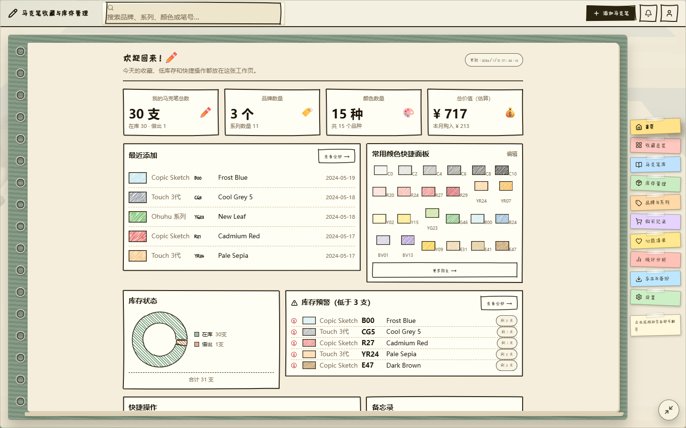
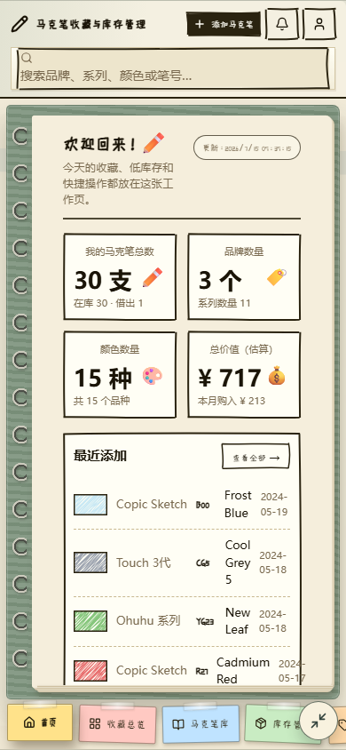

# Tripo Oil-Scene Upgrade Verification

Date: 2026-07-15

Branch: `codex/3d`

Development URL: `http://127.0.0.1:5173/`

Production preview URL: `http://127.0.0.1:4175/`

## Outcome

QA result: **PASS**. The final scene loads the Tripo marker, cup, accepted six-card swatch fan, and two foliage-kit placements; keeps the procedural fallbacks; preserves the live notebook DOM; and passes desktop/mobile rendering, interaction, fallback, build, and production-preview checks.

Task 7 found one release blocker during visual review: with reduced motion enabled, asynchronous WebP and GLB completion did not trigger a published render, so the initial overview could retain a black backdrop and procedural props even while asset diagnostics said `loaded`. A red test observed renderer triangles stuck at `14,562`; the scene now exposes a readiness promise and the React owner calls its existing `renderOnce()` after backdrop and GLB settlement. The focused regression and full suite pass.

`PRODUCT.md` was not changed. The documented scene contract already requires imported assets, procedural fallback, reduced motion, live DOM interaction, and responsive focus behavior; Task 7 corrected an implementation defect without changing that contract.

## Game Design Brief

- User promise: manage a marker collection through a readable notebook while the authored window-and-desk scene supplies atmosphere and object identity.
- Target feeling: focused, tactile, calm, and more materially authored than the procedural baseline.
- Primary verb: focus the notebook, then search, navigate, scroll, or edit the live DOM.
- Objective: complete inventory work without the 3D layer blocking input or readability.
- Pressure and failure: no game pressure; async asset failure must retain a usable procedural scene and live notebook.
- Reward/progression: visible route, search, focus, and modal state changes.
- Non-goals: physics, combat, score, audio, free orbit controls, rasterized DOM, or generated assets fetched at runtime.

## Core Loop

Window/desk overview -> inspect authored imported props -> focus the notebook -> search, sticky-tab navigation, scroll, or modal workflow -> visible DOM state change -> Escape or focus toggle -> overview.

## Level/Encounter Plan

This is a non-game productivity scene. The spatial sequence is wide overview, readable notebook focus, then return. Imported foliage anchors the window sides; markers, swatches, and cup establish foreground material detail. There are no encounters, enemies, physics bodies, colliders, or fail/retry gameplay loops. Asset-load failure is the relevant resilience encounter and is covered independently for all GLBs and foliage only.

## Skill-Loading Ledger

| Skill/workflow | Loaded | Purpose |
| --- | --- | --- |
| `using-superpowers` | yes | Required workflow selection before task action |
| `writing-plans` | yes | Executed the existing Task 7 brief as the release plan |
| `threejs-qa-release` | yes | Browser QA, packaged canvas inspection, release gate, evidence format |
| `frontend-testing-debugging` | yes | Browser-first decision and Playwright fallback contract |
| `browser:control-in-app-browser` | yes | Required in-app Browser bootstrap path |
| `systematic-debugging` | yes | Root-cause analysis for the reduced-motion async redraw defect |
| `test-driven-development` | yes | Red-green regression for async asset redraw |
| `verification-before-completion` | yes | Fresh build, full tests, preview, audit, and VCS gates |
| `threejs-aaa-graphics-builder` reference set | yes | Visual scorecard, imported-asset and technical-art review |
| `threejs-game-ui-designer` reference set | yes | Focus/HUD-equivalent, responsive fit, navigation, modal review |
| `threejs-debug-profiler` reference set | yes | Scene lifecycle, async asset, renderer and performance diagnostics |
| `threejs-3d-generator` | consumed from Tasks 1-6 | Tripo probe, tasks, provider records, immutable PBR sources, runtime derivatives |
| `threejs-image-generator` | consumed from baseline | Existing oil-window concept/backdrop provenance |
| `threejs-audio-generator` | not needed | No audio exists or changed in this productivity scene |

## Reference Ledger

| Reference | Loaded | Applied evidence |
| --- | --- | --- |
| `threejs-qa-release/references/qa-release-checklists.md` | yes | Browser, interaction, mobile, performance, external asset and release matrix |
| `threejs-qa-release/references/checklists/visual-verification.md` | yes | Canvas dimensions, screenshots, pixel sampling, responsive checks |
| `threejs-qa-release/references/checklists/playtest-qa.md` | yes | Focus/search/navigation/modal/resize/refocus workflow; game-only actions N/A |
| `threejs-qa-release/references/checklists/release.md` | yes | Build, preview, hashed assets, console health, bundle review |
| `threejs-qa-release/references/visual-test-harness.md` | yes | Baseline decision and deterministic-state assessment |
| `threejs-qa-release/references/checklists/visual-test-harness.md` | yes | State coverage, masks/thresholds, artifact and flake-risk decision |
| `threejs-aaa-graphics-builder/references/visual-scorecard.md` | yes | Ten-category before/after scorecard and measured evidence |
| `threejs-aaa-graphics-builder/references/implementation-blueprint.md` | yes | Imported asset registry/normalization/diagnostics boundaries |
| `threejs-aaa-graphics-builder/references/model-recipes.md` | yes | Authored silhouette and procedural fallback comparison |
| `threejs-aaa-graphics-builder/references/render-recipes.md` | yes | Camera, lighting, shadows, readability, mobile framing |
| `threejs-aaa-graphics-builder/references/shader-cookbook.md` | yes | Color-space/PBR/post-cost review; no new shader or post pass required |
| `threejs-aaa-graphics-builder/references/technical-art.md` | yes | Render budgets, imported cleanup, instancing, DPR/shadow tradeoffs |
| Graphics checklists: AAA gate, AAA scorecard, material/lighting, performance-safe detail, procedural model, technical art | yes | Premium threshold, automatic failures, budget and material checks |
| `threejs-game-ui-designer/references/ui-patterns.md` | yes | Live notebook hierarchy, focus, modal, tab navigation, mobile fit |
| UI checklists: responsive fit, HUD readability, game UI quality, mobile input | yes | 1440x900 and 390x844 fit, no overflow, stable controls |
| `threejs-debug-profiler/references/debug-profile-checklists.md` | yes | Async asset/root cause, canvas, resize, loading and release diagnostics |
| Debug checklists: scene debugging and performance profile | yes | One canvas, camera/render health, renderer counts, asset URLs |

## Phase Ledger

| Phase | Status | Evidence |
| --- | --- | --- |
| Discovery/contract | done | Task 7 brief, prior reports, asset ledger, clean initial worktree |
| Gameplay systems | done/adapted | Productivity loop: focus, search, tabs, modal, Escape, resize |
| External sourcing | done | Tripo tasks, stable PBR GLBs, rejected swatch evidence, Gemini backdrop |
| AAA graphics | done | Imported props/foliage visible in overview; PBR maps and fallback retained |
| UI | done | Desktop focus, 390x844 focus, no overflow, modal/search/tabs pass |
| Debug/profile | done | Async readiness fix, renderer diagnostics, fallback probes, one-canvas lifecycle |
| QA/release | done | Packaged inspector, build, 8 Chromium tests, production preview |

## External Asset Sourcing

### Credential Probe Output

Exact redacted provider probe output retained from the sourcing phase:

```text
GEMINI_API_KEY=SET
TRIPO_API_KEY=SET
```

No key value, generated temporary URL, or provider secret is present in client code or this report. The Tripo sequence also recorded earlier HTTP 403 insufficient-credit and HTTP 401 authentication failures before successful task creation; the stable downloaded files, not expiring provider URLs, are the runtime inputs.

### Tripo Task IDs And Decisions

| Surface | Task ID | Decision |
| --- | --- | --- |
| Marker | `8d1a2667-995a-4836-9b84-5b51d16cc22c` | accepted |
| Ceramic cup | `03a05f10-8d09-4789-9f67-2bc09a341741` | accepted |
| Swatches first attempt | `0a28e52c-3ac2-49b4-9410-d893b3d61490` | rejected vertical folded pile; retained as evidence |
| Swatches replacement | `8cca30bc-dfdf-4c8c-bd9b-5911669d5857` | accepted six-card 120-degree fan |
| Foliage kit | `25814f77-806a-4286-b7f8-538eb0e85b8d` | accepted |

All accepted tasks report `status=success`, `type=text_to_model`, model `v3.1-20260211`, detailed PBR textures and geometry, smart low poly, auto size, UV export, and Meshopt compression. Exact prompts and provider records remain in `assets/tripo/oil-scene/**` and `docs/verification/2026-07-14-tripo-asset-ledger.md`.

### Chosen Sources

| Surface category | Chosen source | Runtime/stable evidence |
| --- | --- | --- |
| Hero/player | Existing procedural/CSS live notebook | DOM alignment and accessibility remain exact; no generated hero GLB |
| World/sky/background | `threejs-image-generator` baseline plate + Tripo foliage | `src/assets/oil-window-backdrop.webp`, `src/assets/models/oil-scene/foliage-kit.glb` |
| Materials/textures/decals | Tripo PBR base color, normal, metallic-roughness maps + existing shared oil materials | Four runtime GLBs, each with three 1024x1024 JPEG maps |
| Foreground props | `threejs-3d-generator` / Tripo marker, cup, swatches | `src/assets/models/oil-scene/marker.glb`, `cup.glb`, `swatches.glb` |
| Fallback | Procedural Three.js groups | Preserved and tested under total/partial GLB failure |

### Asset Intake Metrics

| Asset | Runtime bytes | Runtime triangles | Textures | Stable runtime path |
| --- | ---: | ---: | ---: | --- |
| marker | 493,932 | 3,168 | 3 x 1024 JPEG | `src/assets/models/oil-scene/marker.glb` |
| cup | 386,132 | 9,437 | 3 x 1024 JPEG | `src/assets/models/oil-scene/cup.glb` |
| swatches | 735,612 | 12,512 | 3 x 1024 JPEG | `src/assets/models/oil-scene/swatches.glb` |
| foliage kit | 1,321,304 | 14,210 | 3 x 1024 JPEG | `src/assets/models/oil-scene/foliage-kit.glb` |

One-each runtime-source total: **39,327 triangles**. Visible imported scene total: **75,713 clone-aware triangles** (47,293 desk + 28,420 two foliage placements). Per the explicit user override, the clone-aware 75,713 value is **informational only** and must not fail tests or trigger rollback. Hard renderer budgets remain fewer than 120 draw calls and fewer than 250,000 total visible triangles.

## Technical Art

- Art direction: painterly window plate, live paper notebook, PBR ceramic/paper/marker/foliage accents, warm key/fill and restrained ambient motion.
- Hero surfaces: notebook readability and foreground imported props at overview distance.
- Support surfaces: shared marker clones, two foliage clones, procedural fallbacks, generated image plate, culled scene layers.
- Material kit: existing paper, cloth, wood, metal, foliage, water and signal roles; imported standard materials clamp roughness to at least `0.62` and metalness to at most `0.2`.
- Asset cleanup: normalized scale/pivot/bounds, ground at `Y=0`, wrapper-only positive placement transforms, shared clone resources, PBR maps resized to 1024.
- Instancing/LOD/culling: marker and foliage clones share resources; camera frustum culling reduces focus/mobile counts. No added LOD because each imported family has at most eight/two placements and total renderer budgets pass.
- Renderer: sRGB output, ACES filmic tone mapping, exposure `1.08`, PCF shadow map, one 1024 shadow map, no post-processing chain.
- DPR: controller cap is desktop `1.75`, mobile `1.35`; measured Task 7 QA used DPR 1 and inspector mobile drawing buffer 526x896 for 390x664 CSS.
- VFX readability: only subtle foliage root sway and existing environmental motion; reduced motion freezes it. No effect obscures the notebook or controls.

## Render Budget

| Scenario | Draw calls | Triangles | Geometries | Textures | Result |
| --- | ---: | ---: | ---: | ---: | --- |
| Desktop overview, production preview, reduced motion | 68 | 156,628 | 45 | 17 | project cap pass; desktop tier pass |
| Desktop focus, development QA | 54 | 120,855 | 45 | 11 | pass |
| Mobile focus 390x844 | 34 | 78,099 | 23 | 5 | project cap pass; mobile tier pass |
| All-GLB procedural fallback | 111 | 14,562 | 41 | 5 | pass |
| Foliage-only fallback | 118 | 107,180 | 44 | 14 | pass; close to the project draw-call cap |

Starting-point technical-art tiers are desktop 300 calls/750k triangles/300 geometries/60 textures and mobile 150/300k/200/40. No row exceeds either the applicable tier or the stricter project caps. The packaged inspector reports `renderBudget: null` because this application publishes `window.__BOOK_SCENE_DIAGNOSTICS__`, not the generic `window.__THREE_GAME_DIAGNOSTICS__`; the table above is the direct app diagnostic evidence.

## Browser QA

The requested in-app Browser path was attempted first. Browser runtime setup failed twice, including after a clean reset, with the exact error:

```text
Cannot redefine property: process
```

The brief explicitly permits an in-app-browser equivalent, so QA continued through the repository Playwright Chromium runtime.

| Check | Result |
| --- | --- |
| Page identity | `http://127.0.0.1:5173/`, title `Hand-drawn Inventory Management UI` |
| Meaningful DOM | body text length 857, one visible `.book-page` |
| Framework overlay | 0 |
| Console/page/network health | 0 app console errors, 0 page errors, 0 failed requests, 0 HTTP >=400 responses |
| Focus toggle | overview -> focus, `aria-pressed=true`; Escape -> overview |
| Search | `Copic` -> `/library?q=Copic` with book visible |
| Sticky navigation | 10 tabs; second tab -> `/overview` |
| Modal | first header command opened dialog; Escape closed it |
| Desktop | overview and focus captured at 1440x900 |
| Mobile | focus captured at 390x844; horizontal overflow 0 |
| Canvas lifecycle | exactly one canvas after mobile resize, desktop resize, and reload |
| Reduced motion | `animationActive=false`, motion tick stable, async assets redraw after readiness |

Chromium emitted four GPU `ReadPixels` performance advisories while screenshots/pixel reads were taken. They are browser-driver warnings caused by verification reads, not application console errors.

## Release Blocker Found And Fixed

Reproduction: open with `prefers-reduced-motion: reduce`, wait until `deskProps=loaded` and `foliage=loaded`, and do not resize or toggle focus. Before the fix, published renderer triangles remained `14,562` and the overview could retain the black/untextured backdrop plus procedural foliage.

Root cause: `TextureLoader` and `GLTFLoader` settle after the one reduced-motion render. The asset loader mutated scene objects and nested asset diagnostics, but no animation loop or owner-level render/publish followed.

Red-green evidence:

```text
RED: redraws async backdrop and imported assets under reduced motion
Expected triangles > 100000; received 14562; 1 failed.

GREEN: the same focused command passed 1/1 in 3.3s.
FULL: 8 Chromium tests passed in 37.3s.
```

Implementation: `WorldBuildResult.backdropReady` resolves on texture load/error; `OilSceneController.ready` combines backdrop and imported-asset settlement; `BookDeskScene` calls its existing `renderOnce()` only if the controller is still current. Existing disposal and reduced-motion guards remain intact.

## Canvas Pixel Inspection

The packaged `threejs-qa-release/scripts/inspect-threejs-canvas.mjs` was copied unchanged to the repository root for module resolution, run, then removed. Direct execution from the skill directory first failed because external ESM resolution could not find the project `@playwright/test`; the unchanged local copy then required `pngjs@7.0.0`, installed to `node_modules` only with `--no-save --package-lock=false`. No package manifest or lockfile changed.

| Metric | Desktop 1280x720 | Mobile 390x664 |
| --- | ---: | ---: |
| Result | nonblank | nonblank |
| Drawing buffer | 1280x720 | 526x896 |
| Alpha samples | 4,096 | 4,097 |
| Pixel variance | 248 | 249 |
| Color buckets | 415 | 175 |
| Color entropy | 5.39 bits | 3.78 bits |
| Edge density | 0.375 | 0.365 |
| Luminance contrast | 152.1 | 213.7 |
| Dominant color share | 0.172 | 0.317 |
| Non-background share | 0.828 | 0.683 |
| Console/page errors | 0 / 0 | 0 / 0 |

Measured evidence does not indicate a sparse or hidden scene: entropy is above 3, edge density is far above 0.04, luminance contrast is above 60, and dominant share is below 0.6 in both modes.

Inspector artifacts (not committed):

- `C:\Users\zz\AppData\Local\Temp\marker-task7-inspector-desktop\desktop.json`
- `C:\Users\zz\AppData\Local\Temp\marker-task7-inspector-mobile\mobile.json`

## Fallback Evidence

All-GLB abort: `deskProps=fallback`, `foliage=fallback`, imported meshes/materials/textures/triangles all 0, one canvas, live page visible. Four expected browser `net::ERR_FAILED` resource messages and one application error per asset group were observed.

Foliage-only abort: `deskProps=loaded`, `foliage=fallback`, imported diagnostics 10 meshes/3 materials/9 textures/47,293 triangles. Search still reached `/library?q=Copic`; one expected browser resource failure and one `Unable to load Tripo foliage` application error were observed.

The normal path has no console/page/network errors. Fallback errors are deliberate evidence from request interception and are not release-health failures.

## Build And Release

`npm run build` passed: Vite 6.3.5 transformed 2,375 modules and built in 4.24s. It emitted all four hashed GLBs and the 112.30kB backdrop. The only warning is the allowed chunk-size advisory: JavaScript is 1,497.39kB minified / 414.36kB gzip.

`npx playwright test --project=chromium` passed **8/8** in **37.3s**, including page-flip patch idempotence, success, total fallback, partial fallback, focus, mobile, reduced motion, async redraw, navigation, modal, resize, and lifecycle checks.

Production preview at `http://127.0.0.1:4175/` returned 200 for:

- `/assets/marker-BeHdUskJ.glb`
- `/assets/cup-BDDor0z2.glb`
- `/assets/swatches-BSZ-xOFG.glb`
- `/assets/foliage-kit-B0vSPl-T.glb`

Preview identity, focus, 390x844 resize, zero overflow, one canvas, console/page/network health, and loaded diagnostics all passed. Default `npm run build` assumes root hosting; `npm run build:pages` remains the GitHub Pages `/marker-inventory-cn/` build.

## Visual Scorecard

The before column is the verified procedural scene from `2026-07-10-oil-painting-3d-scene-report.md`; the after column is the complete Tripo upgrade. Game-oriented terms are adapted: hero/player = notebook, obstacles/enemies = supporting props/occlusion risks, rewards/interactables = live DOM workflows.

| Category | Before | After | Evidence |
| --- | ---: | ---: | --- |
| Art direction | 3 | 3 | Oil backdrop, paper UI, ceramic, painted markers, swatches and foliage share a studio language |
| Hero/player | 2 | 2 | Notebook hero is unchanged: rings, holes, cloth, paper depth, focus state |
| Obstacles/enemies | 2 | 2 | Varied imported silhouettes remain outside the interaction path; no game enemies apply |
| Rewards/interactables | 2 | 2 | Focus, search, tabs and modal produce real state changes; unchanged by asset swap |
| World/environment | 3 | 3 | Foreground props, notebook, window, two authored foliage placements and far plate preserve depth |
| Materials/textures | 2 | 3 | Twelve imported 1024 PBR maps add authored base-color/normal/roughness detail within budget |
| Lighting/render | 2 | 2 | PBR assets read under ACES/key/fill/shadows; no post chain or showcase lighting pass |
| VFX/motion | 2 | 2 | Imported foliage root sway integrates with reduced motion; event VFX is not applicable |
| UI/HUD | 3 | 3 | Live notebook remains readable, route-aware, modal-safe and responsive at 390x844 |
| Performance evidence | 3 | 3 | Intake, clone-aware override, renderer, inspector, build, preview and fallback metrics recorded |

Measured evidence: desktop/mobile entropy 5.39/3.78, edge density 0.375/0.365, contrast 152.1/213.7, dominant share 0.172/0.317; renderer desktop overview 68 calls/156,628 triangles/45 geometries/17 textures; mobile focus 34/78,099/23/5.

Average: before **2.4**, after **2.5**. Every category is at least 2, so the adapted premium threshold passes. Automatic failures remaining: **none**. The active overview is not primitive-dominant; the world is layered; imported assets are visible; UI does not overlap incoherently; real input works; screenshots and renderer/technical-art diagnostics exist.

## Fresh-Eyes Placeholder

No independent subagent mechanism is exposed in this session. This section is the explicit placeholder for a future independent reviewer who should receive the complete capture set and the two inspector JSON files without build history. Until that review exists, the required fallback is the adversarial fresh-eyes review below; no higher independent score is claimed.

## Fresh-Eyes Review

- Art direction could be 1 because imported Tripo colors are brighter and sharper than some procedural oil surfaces; repeated painterly color blocking and the studio composition support 3.
- Hero/player could be 1 because the notebook is still broadly rectangular and unchanged by this task; layered rings, paper, cloth and focus behavior support 2.
- Obstacles/enemies could be 1 because there are no game hazards and marker silhouettes repeat; the adapted productivity contract and varied cup/swatch/foliage forms support 2.
- Rewards/interactables could be 1 because these are conventional web controls; spatial focus, page routing, search and modal state support 2.
- World/environment could be 1 because the water remains a simple plane and foliage repeats twice; clear foreground/midground/background depth and authored foliage support 3.
- Materials/textures could be 1 because the imported assets use only one material each; twelve PBR maps, normal response, roughness clamp and visible surface variation support 3.
- Lighting/render could be 1 because there is no environment map or cinematic post chain; readable ACES/key/fill/contact treatment and measured contrast support 2.
- VFX/motion could be 1 because motion is ambient and slight; purposeful foliage/environment motion plus complete reduced-motion shutdown support 2.
- UI/HUD could be 1 if read as a dashboard over a canvas; the notebook-specific live DOM, stable focus state, tabs, mobile reflow and zero overflow support 3.
- Performance evidence could be 1 without hardware FPS/frame-time capture; renderer, intake, inspector, fallback, build, preview and mobile evidence support 3 while retaining that caveat.

Reconciled self-scores are the lower defensible values shown in the scorecard. The strongest visible weakness is material/style mismatch between some bright imported marker paint and the softer procedural scene, not a release blocker.

## Visual Test Harness Decision

Decision: **extended structural/pixel harness; skipped pixel-perfect screenshot baselines**.

States covered: desktop overview, desktop focus, 390x844 mobile focus, reduced-motion async-ready overview, all-GLB fallback, foliage-only fallback, resize/reload lifecycle. Determinism uses reduced motion and loaded-state waits. Canvas nonblank/pixel metrics and interaction checks remain separate.

The three accepted screenshots are committed evidence, not `toHaveScreenshot()` baselines. Strict baselines were skipped because platform WebGL antialiasing, font rasterization, the live current-time label, and GPU readback warnings make cross-run pixel diffs flaky; masking the notebook/time region would remove much of the acceptance surface. Therefore there is no baseline update command, compare command, mask, or diff threshold. The compare command remains the structural/pixel gate: `npx playwright test --project=chromium` plus the packaged inspector commands below.

## Screenshots

Screenshot evidence was captured from the post-fix build and visually inspected before acceptance.

Baseline comparison: `docs/verification/assets/oil-scene/desktop-overview.png`.

Accepted evidence:







| File | Bytes | SHA-256 |
| --- | ---: | --- |
| `desktop-overview.png` | 757,456 | `707710D21F111BA9E2CC229725730F8476EEA825D1FB1FA85A71FF55EA9BAFD6` |
| `desktop-focus.png` | 300,584 | `B70BBA31286C98E6F631E0C60581B0942145F9DFD739BFD70B42D88958A31B87` |
| `mobile-focus.png` | 117,104 | `65FCCE0010A3E45387AF879DB9775AD1F0BA5C3CE4384C55CE5E4DD7CE1FDCD3` |

The overview is the asset-visibility proof: all imported families and both foliage placements are visible. Focus captures intentionally prove the product contract that the live notebook dominates the working viewport.

## Commands

```powershell
npm run dev -- --host 127.0.0.1 --port 5173
npx playwright test tests/book-desk-scene.spec.ts --project=chromium -g "redraws async"
npm install --no-save --package-lock=false pngjs@7.0.0
Copy-Item "C:\Users\zz\.agents\skills\threejs-qa-release\scripts\inspect-threejs-canvas.mjs" inspect-threejs-canvas.task7.mjs
node inspect-threejs-canvas.task7.mjs --url http://127.0.0.1:5173 --out "$env:TEMP\marker-task7-inspector-desktop" --wait 1500
node inspect-threejs-canvas.task7.mjs --url http://127.0.0.1:5173 --out "$env:TEMP\marker-task7-inspector-mobile" --mobile --wait 1500
Remove-Item inspect-threejs-canvas.task7.mjs
npm run build
npx playwright test --project=chromium
npx vite preview --host 127.0.0.1 --port 4173 # selected 4175 because 4173/4174 were occupied
python "C:\Users\zz\.agents\skills\threejs-game-director\scripts\audit_reference_report.py" --premium "docs\verification\2026-07-14-tripo-scene-upgrade-report.md"
```

## Residual Risks

- Chromium only; Firefox, WebKit/Safari, and physical mobile GPU behavior were not measured.
- No hardware FPS/frame-time trace was captured; renderer budgets and headless pixel evidence are proxies.
- The 1,497.39kB minified JavaScript chunk still exceeds Vite's 500kB advisory and may delay first interaction on slow networks.
- The foliage-only fallback reaches 118 draw calls, only two below the project cap of 120.
- Imported marker paint is visually brighter than the softest procedural surfaces; future art-direction work could rebalance texture saturation without changing geometry.
- The packaged inspector cannot consume the app-specific diagnostic namespace, so its generic `renderBudget` block is null; direct app diagnostics are recorded instead.
- Independent fresh-eyes scoring remains a placeholder because no subagent mechanism was available.
- Audio, physics, bot playtest, fail/retry gameplay, and touch gameplay controls are not applicable to this productivity interface.

## Director Audit

Command: `python "C:\Users\zz\.agents\skills\threejs-game-director\scripts\audit_reference_report.py" --premium "docs\verification\2026-07-14-tripo-scene-upgrade-report.md"`

Result: `Director report audit passed.`
